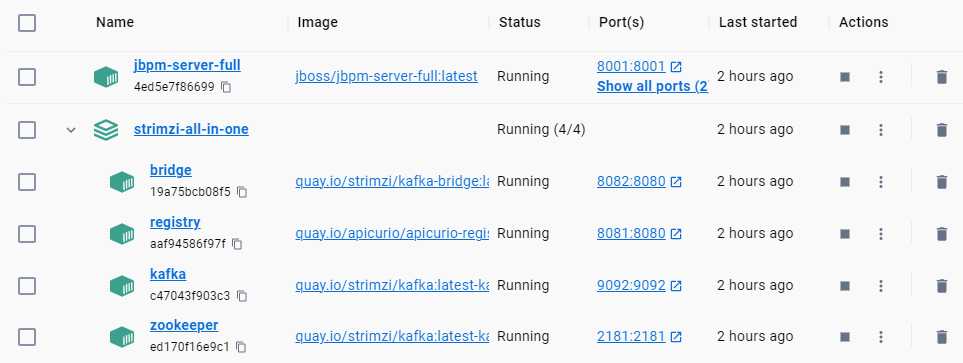

Personally, I find running jBPM on Docker the easiest to setup and is useful for a quick demo.

Somehow I couldn't install Red Hat Process Automation Manager into my local machine works but for anyone that is interested, these are some links that you might find useful:

1. [Red Hat Process Automation Manager 7 Install Demo](https://github.com/jbossdemocentral/rhpam7-install-demo)
2. [Getting Started with IBAMOE](https://timwuthenow.github.io/guided_exercises/04_order_management/01_try-order-management-app/#pre-requisites)

### Running jBPM Server on Docker

1. The instruction is in [Running jBPM Docker Image](https://www.jbpm.org/learn/gettingStartedUsingDocker.html). Or simply, run the below command.

> docker run -p 8080:8080 -p 8001:8001 -d --name jbpm-server-full jboss/jbpm-server-full:latest

You should see a container named **_jbpm-server-full_** in the Docker Desktop.

Make sure that both **_jbpm-server-full_** and **_strimzi-all-in-one_** are running.

If everything is configured correctly, now you can access these pages from the link:

1. [Business Central - http://localhost:8080/business-central](http://localhost:8080/business-central)
2. [KIE Server - http://localhost:8080/kie-server/services/rest/server](http://localhost:8080/kie-server/services/rest/server)
3. [KIE Server Swagger docs - http://localhost:8080/kie-server/docs](http://localhost:8080/kie-server/docs)
