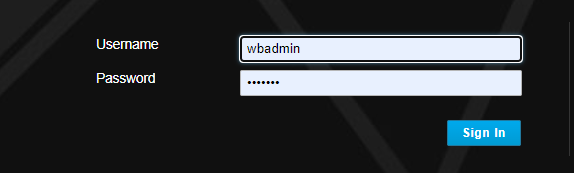
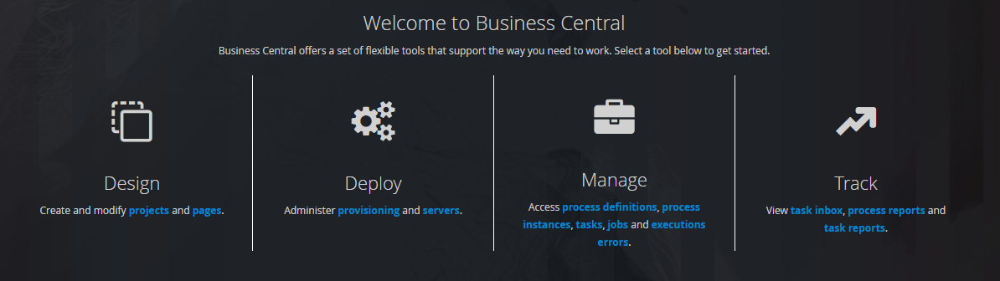
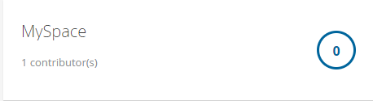
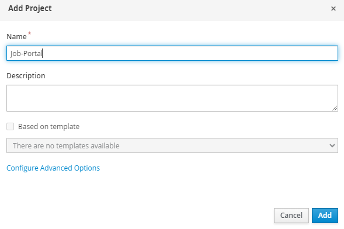

1. Login to the [Business Central](http://localhost:8080/business-central)

   There is a set of predefined _username/password_ that can be used to log directly into Business Central with different permissions:

   - wbadmin/wbadmin
   - krisv/krisv
   - john/john
   - mary/mary
   - katy/katy
   - jack/jack
   - kieserver/kieserver1!

   We will use the _wbadmin/wbadmin_ which has the highest permissions to login.

   

2. After logging in, you will see four categories:

   

   - Design is for creating process applications.
   - Deploy manages servers.
   - Manage is used by admins to look at various items (process definitions, process instances, audit trails, and work re-allocation).
   - Track is used to access dashboarding capabilities.

3. Go to the **projects**. Then click on the **MySpace** tile.

   Business Central is organized into workspaces that act as containers for various projects.

   

4. Create a new project with **Add Project** and name it as _Job-Portal_.

   

Next, we will start adding assets for our new project.
