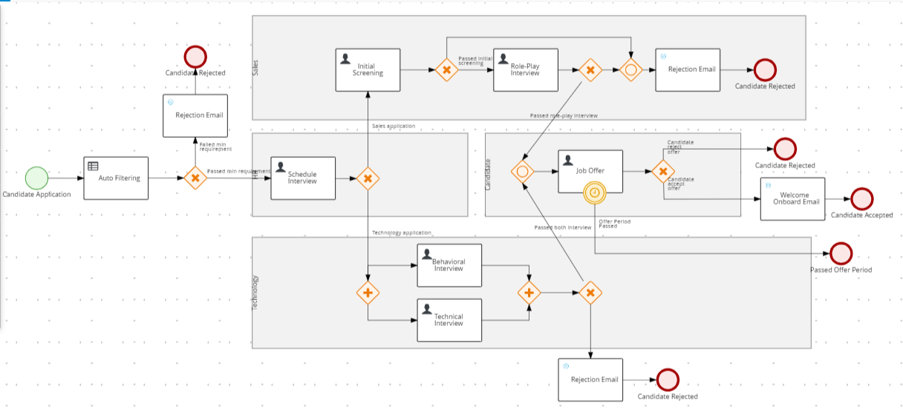

Before we start building the workflow, I would want to list down what functionalities I would like it to achieve.

### The actors:

- Candidate
- HR
- Sales Team
- Technology Team

### The user tasks:

- Sales Application:

  - Initial Screening (Solo): This task should be assign to a particular person.
  - Role-play Interview (Team): This task can be done by any person in the Sales Team. This task will only be invoked if an candidate passes the initial screening.

- Technology Application:
  - Behavioral Interview (Solo): This task should be assign to a particular person.
  - Technical Interview (Team): This task can be done by any person in the Technology Team.

### The roles and responsibilities:

- Candidate:

  - Create an job application with their information.
  - Receives email if they are rejected at any point.
  - If they are accepted, receives a job offer.
  - If they accept the job offer, receives a welcoming email.

- HR:

  - Receives job application.
  - Assign solo task to a person.
  - Schedule interview.

- Sales Team:

  - Pass/Fail a candidate in team task.

- Technology Team:

  - Pass/Fail a candidate in team task.

- Individual:

  - Pass/Fail a candidate in solo task.

### Automated task

- After receiving an application, automatically reject if they do not meet the minimum requirements:

  1.  Above 21 years old.
  2.  Do not have a minimum of 3.8 scores. Scores are calculated as below:

      - Base score: the candidate's GPA.
      - Additional score:

        - Gender Advantage:
          1. Women applying to technology receives additional 0.2 score.
          2. Men applying to sales receives additional 0.1 score.
        - University Advantage:

          |     | University                 | Score |
          | --- | -------------------------- | ----- |
          | 1   | Universiti Malaya (UM)     | 0.3   |
          | 2   | Monash University (Monash) | 0.2   |
          | 3   | Sunway University (Sunway) | 0.1   |

- If the candidate does not respond to a job offer within allocated time, automatically reject the application.

### Overview

To illustrate the workflow more clearly, you can refer to the Business Process Model and Notation (BPMN) diagram below.

This workflow diagram is mainly what we will be making in our project.

In my opinion, this shows one of the main advantage of using RHPAM, which is the project made can be understood both by the programmer and someone on the management side easily. In a sense, it is also easier to verify the correctness of our project as the backend logic is handled by the RHPAM.

Next, we will start making our RHPAM project. Firstly, we are going to create the data objects needed.
