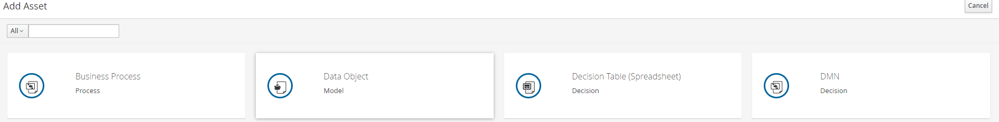
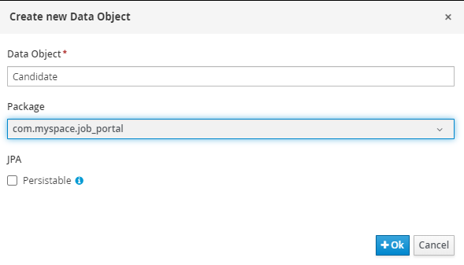
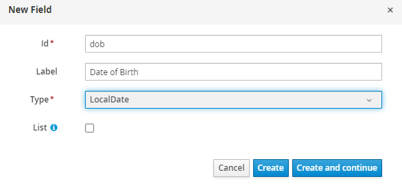
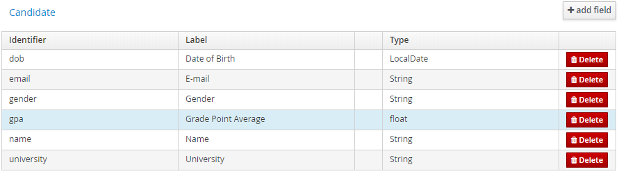

Data objects are implemented as a Java class in jBPM. However, they are more like struct as it contains variables with different data types.

### Create a data object

1. Click the **Add Asset** and click on the **Dats Object**.

   

2. Create a data object named _Candidate_ and change its package to _com.myspace.job_portal_.

   

### Adding field

1.  Press the **Add Field+** and it will prompt a **New Field** form.

    

2.  After filling in the _id_, _Label_ and _Type_, press **Create and continue** to add more fields.

3.  I will list the fields to be added in a table:

    | Identifier | Label               | Type      |
    | ---------- | ------------------- | --------- |
    | dob        | Date of Birth       | LocalDate |
    | email      | E-mail              | String    |
    | gender     | Gender              | String    |
    | gpa        | Grade Point Average | float     |
    | name       | Name                | String    |
    | university | University          | String    |

4.  The candidate object should look like this.

    

5.  Press **Save** to save the changes.
