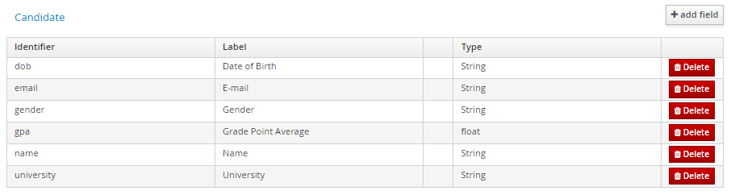

Data objects are implemented as a Java class in jBPM. However, they are more like struct as it contains variables with different data types.

For our project, we only need 1 data object.

### Create a data object

1. Click the **Add Asset** and click on the **Data Object**.

   

2. Create a data object named _Candidate_ and change its package to _com.myspace.job_portal_.

   

### Adding field

1.  Press the **Add Field+** and it will prompt a **New Field** form.

    

2.  After filling in the _id_, _Label_ and _Type_, press **Create and continue** to add more fields.

3.  I will list the fields to be added in a table:

    | Identifier | Label               | Type      |
    | ---------- | ------------------- | --------- |
    | dob        | Date of Birth       | LocalDate |
    | email      | E-mail              | String    |
    | gender     | Gender              | String    |
    | gpa        | Grade Point Average | float     |
    | name       | Name                | String    |
    | university | University          | String    |

4.  The candidate object should look like this.

    

5.  Press **Save** to save the changes.

### Create Another Data Object.

1. Create another data object named _Interview_ and package _com.myspace.job_portal_.

2. Put in the following fields:

   | Identifier        | Label                   | Type          |
   | ----------------- | ----------------------- | ------------- |
   | interviewDateTime | Interview Date and Time | LocalDatetime |
   | interviewer       | Interviewer             | String        |

3. It should look like this:

   

4. Press **Save**

### Modifying String Representation

As you may have already guessed, the data objects are Java objects as we can see from the `.java` extension.

To help us see the values of our data objects, we will `override` the `toString` method to return the value of the fields.

1. Go to **Source** and add these code to the _Candidate_ and _Interview_ object respectively:

   Candidate.java:

   ```java
   @Override
   public String toString() {
       return this.name + " " + this.dob + " " + this.gender + " " + this.email + " " + this.gpa + " " + this.university;
   }
   ```

   Interview.java:

   ```java
   @Override
   public String toString() {
       return this.interviewDateTime + " " + this.interviewer + " ";
   }
   ```

2. It should look as below:

   Candidate.java:

   

   Interview.java:

   

Next, we will use Decision Model and Notation(DMN) to automate the checking of minimum requirements.
