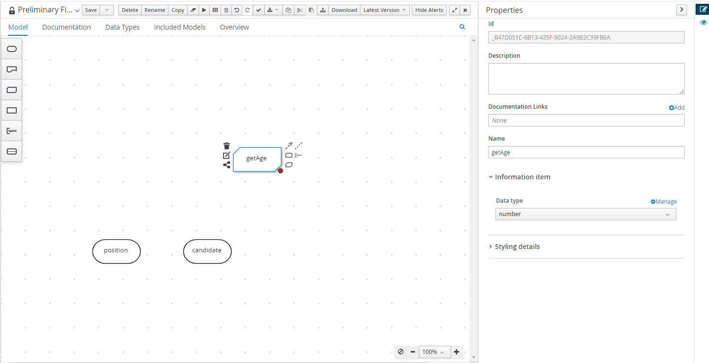

### Learning Resources

Before starting, you can refer to the following resources for some information about DMN which I find useful:

1. [Learn DMN in 15 minutes](https://learn-dmn-in-15-minutes.com/learn/introduction)
2. [DMN: What's a Hit Policy](https://methodandstyle.com/dmn-whats-hit-policy/)

### Adding DMN asset

1. Press the **Add Asset** and click on the **DMN** tile.

2. Name the DMN as _Preliminary Filtering_ and set the package to _com.myspace.job_portal_. Press **OK** to create the asset.

   

3. Press the pencil icon at the top right corner. Then, change the DMN model name to _prelim-filtering_.

   

### Adding Custom Types

1. Press the **Data Types** tab. We will need to create some data types to be used in our DMN model.

   

2. Press the **Add a custom Data Type**. Then set the name to _University_ and type to _String_ and then press the tick mark.

   

3. Press the **New Data Type**. Then set name to _Position_ and type to _String_ and enter.

4. Add a new data type with name as _Gender_ and type as _String_. Then press **Add Constraints**. Select **Enumeration** from the dropdown. Insert _male_ and _female at the box as we want to restrict the values for the \_Gender_ data type.

   

5. Add a new data type with name as _Candidate_ and type as _Structure_.

   

6. Fill in the fields of the _Candidate_ structure as below.

   

7. Press **Save** to save the changes.

### Creating model

#### Input Data (Oval node)

Input data elements denote information used as input for one or more decisions.

When enclosed within a Business Knowledge Model (BKM), they indicate parameters for the BKM node.

1. Navigate back to the **Model** tab.

2. Drag the oval node / input-data node into the canvas.

3. Press the node and click the pencil icon (properties) on the top right corner. Change the name to _position_ and Data Type to _Position_.

   

4. Create another input-data node with name _candidate_ and type _Candidate_.

#### Business Knowledge Model(BKM) (Trapezoid-ish Node)

BKMs encapsulate business knowledge as reusable functions.

The decision logic can hold a FEEL function, a Java method invocation, or a PMML invocation.

TLDR: I just think of it as a function.

We will create a BKM model to calculate age from date of birth using FEEL expression.

1. Drag the trapezoid-ish node.

2. Change the name to _getAge_ and data type to _number_ as we want to return age which can be represented as a number.

   

3. Press the **Edit** icon.

   

4. Press the **Edit Parameters**, then **Add parameter** and type in name as _dob_ and type as _date_.

   

   Since BKM is a function, the parameter is what needed to be supplied to this function. The _getAge_ function has function signature that looks something like this `int getAge(date dob)`.

5. Copy the code into the empty field below:

   ```
    if (today().month < dob.month or (today().month = dob.month and today().day < dob.day)) then
        today().year - dob.year - 1
    else
        today().year - dob.year
   ```

6. Press **Save** to save the changes.

#### Decision (Rectangle Node)

Decisions determine an output value depending on:

- their input data (input nodes or the output value from other decisions)
- their decision logic - boxed expressions that may reference functions from BKM nodes

We will make 3 decisions node, called _Gender Advantage_, _University Advantage_ and finally _Preliminary Filtering_.

##### Gender Advantage

1. Drag a decision node and named it to _Gender Advantage_ and set the data type to _number_.

2. Press the **Edit** button of the node.

3. Press the **Select expression** and choose **Decision Table**.

   

4. Press the initially **U** on the top left corner of the table to edit the hit policy. Change the hit policy to **COLLECT** and builtin aggregator to **MAX**.

   

5. The light blue box on the first row represents input and dark blue represents output. Right click on the light blue box and press **Insert right** to add another column of input.

   

6. Similarly, right click the **1** and press **Inser below** to add another row.

   

7. Fill in the table as below:

   | C>  | candidate.gender<br/> (Gender) | position<br/> (Position) | Gender Advantage<br/> (number) | annotation-1 |
   | --- | ------------------------------ | ------------------------ | ------------------------------ | ------------ |
   | 1   | "male"                         | "sales"                  | 0.1                            |              |
   | 2   | "female"                       | "technology"             | 0.2                            |              |
   | 3   | -                              | -                        | 0                              |              |

8. The table should look like this:

   

9. Connect the input data _position_ and _candidate_ to the _Gender Advantage_ node like below:

   

   Notice that in the decision table above, we have 2 inputs which are _position_ and _candidate.gender_ respectively. This is the reason why we need to have the 2 input data supplied to our decision node.

##### University Advantage

1. Repeat the steps for _Gender Advantage_ but with the following table:

   | C>  | candidate.university<br/> (University) | University Advantage<br/> (number) | annotation-1 |
   | --- | -------------------------------------- | ---------------------------------- | ------------ |
   | 1   | "um"                                   | 0.3                                |              |
   | 2   | "monash"                               | 0.2                                |              |
   | 3   | "sunway"                               | 0.1                                |              |
   | 4   | -                                      | 0                                  |              |

2. The table should look like this:

   

3. Connect the input data _candidate_ to the _University Advantage_.

   

##### Preliminary Filtering

1. Create a decision node names _Preliminary Filtering_ and data type _boolean_.

2. Click the **Select expression** and choose the **Literal expression** logic type.

3. Copy the code below to the empty space:

   ```
   (Gender Advantage + University Advantage + candidate.gpa > 3.8) and getAge(candidate.dob) > 21
   ```

   

4. Connect the input data _candidate_, decision _Gender Advantage_, _University Advantage_ and BKM _getAge_ to the _Preliminary Filtering_ node.

   

   Notice that the FEEL expression uses the BKM _getAge_ and supply it with the argument _candidate.dob_ to check the age is greater than 21.

   Candidate's score is calculated by summing the candidate's gpa, and additional scores(Gender Advantage and University Advantage).

   Preliminary Filtering returns true if the candidate's age is greater than 21 and the candidate's score is greater than 3.8.

5. Press **Save** to save the changes.

Next, we will explore on testing the DMN.
