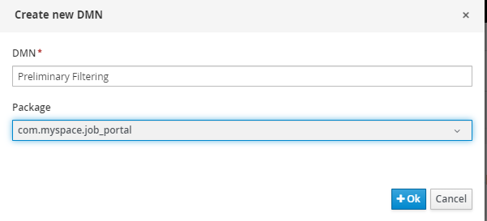

### Learning Resources

Before starting, you can refer to the following resources for some information about DMN which I find useful:

1. [Learn DMN in 15 minutes](https://learn-dmn-in-15-minutes.com/learn/introduction)
2. [DMN: What's a Hit Policy](https://methodandstyle.com/dmn-whats-hit-policy/)

### Adding DMN asset

1. Press the **Add Asset** and click on the **DMN** tile.

2. Name the DMN as _Preliminary Filtering_ and set the package to _com.myspace.job_portal_. Press **OK** to create the asset.

3. Press the pencil icon at the top right corner. Then, change the DMN model name to _prelim-filtering_.

4. Press the **Data Types** tab. We will need to create some data types to be used in our DMN model.

5. Press the **Add a custom Data Type**. Then set the name to _Candidate_ and type to _Structure_.

