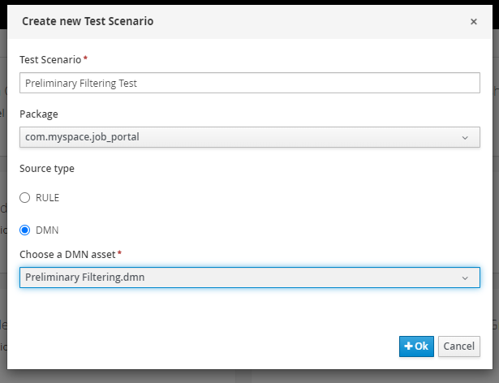
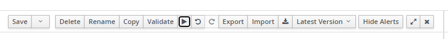
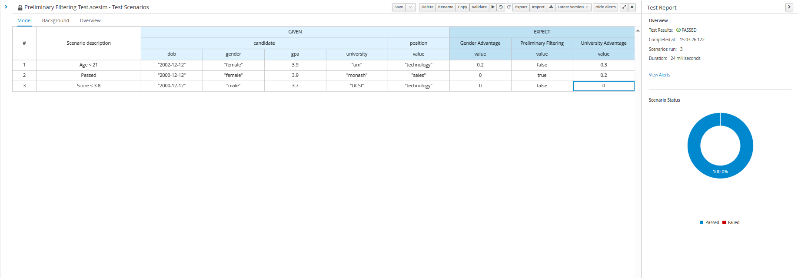

We can utilize the test scenario asset in business central to help us test out our dmn.

### Creating Test Scenario

1.  Click **Add Asset** and choose the **Test Scenario**.

2.  Name the test scenario as _Preliminary Filtering Test_, package to _com.myspace.job_portal_,
    source to _DMN_ and DMN asset to _Preliminary Filtering.dmn_.

    

### Creating Test Cases

1.  Write down a test case as below:

    <table>
    <thead>
        <tr>
        <th rowspan="3">#</th>
        <th rowspan="3">Scenario description</th>
        <th colspan="5">GIVEN</th>
        <th colspan="3">EXPECT</th>
        </tr>
        <tr>
        <th colspan="4">candidate</th>
        <th>position</th>
        <th>Gender Advantage</th>
        <th>Preliminary Filtering</th>
        <th>University Advantage</th>
        </tr>
        <tr>
            <th>dob</th>
            <th>gender</th>
            <th>gpa</th>
            <th>university</th>
            <th>value</th>
            <th>value</th>
            <th>value</th>
            <th>value</th>
        </tr>
    </thead>
    <tbody>
        <tr>
        <td>1</td>
        <td>Age < 21</td>
        <td>date("2002-12-12")</td>
        <td>"female"</td>
        <td>3.9</td>
        <td>"um"</td>
        <td>"technology"</td>
        <td>0.2</td>
        <td>false</td>
        <td>0.3</td>
        </tr>
    </tbody>
    </table>

2.  Press the **Play** button above to run the test case. If the result of the test is same as the value provided in the **_EXPECT_** column, the scenario status will show 100% passed, else actual values that are different from expected values will be highlighted in red.

    

3.  Below shows some sample test cases:

    

### Resources

Here is a link on how to create useful test cases:

1. [Test Case Design](https://nus-cs2103-ay2223s2.github.io/website/se-book-adapted/chapters/testCaseDesign.html)

We will next look at how to create an email workitem in RHPAM.
