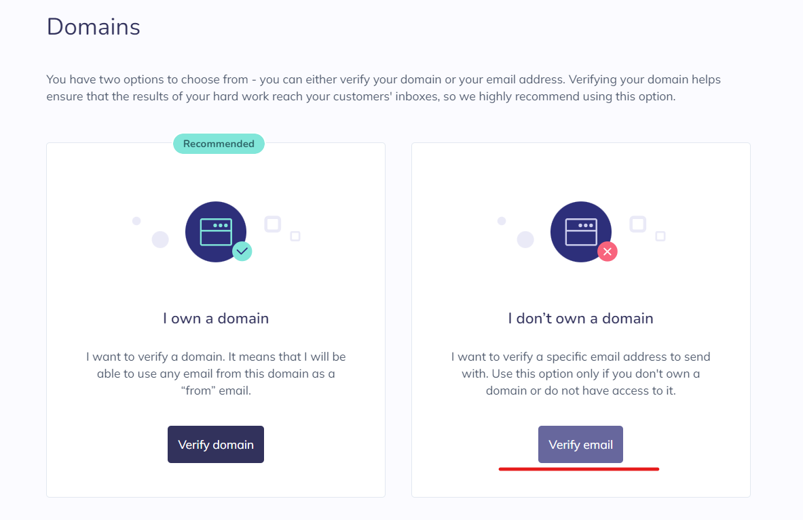

If you know how to set up SMTP service, then you can skip this.
{:.info}

### Sign up for Elastic Email

1. Go to the elastic email [website](https://elasticemail.com/) and sign up for an account.

2. Go to **[Settings](https://app.elasticemail.com/api/settings)**, then under the **Domains** box, click on **Manage Domains**.

   

3. Go to **Start verification** then **Verify email**.

   

4. Enter the email address that you wish to be sent from and check your mailbox to verify the email.

   

### Verify that email is set

1. Go to **Manage Domains** and check that the email is listed under **Email verification**.

### Create SMTP in Elastic Email

1. Go to **Settings** and click on **Create SMTP Credentials** under **SMTP**.

2. Key in your email address as the **Username** and click on **Create**.
   

3. Copy the password and other details as you won't be able to access them after closing the pop up window.

4. Your SMTP server is successfully created.

### Side note

If you wish to set up SMTP with Gmail, [this](https://www.youtube.com/watch?v=1YXVdyVuFGA&ab_channel=Sombex) guide might be useful.

However, you will probably need to do some additional steps as Google requires OAuth for their gmail SMTP server.
