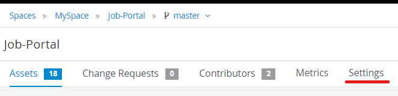
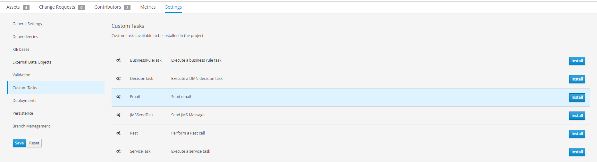
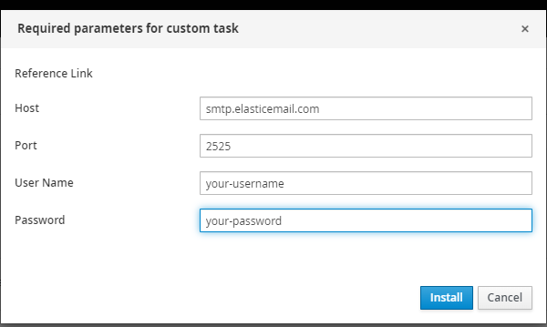
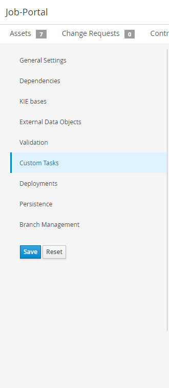

Refer to [this](https://www.youtube.com/watch?v=7e8koGi7Xqo) if you prefer to follow a video.

### Create custom task

1. Go to **Settings**.

   

2. Go to **Custom Tasks** and click the **Install** button of _Email_.

   

3. Fill in the parameters based on the SMTP server you set up.

   

4. Press **Save** on the left.

   

We will be using this email address to send email to candidates in our project.
