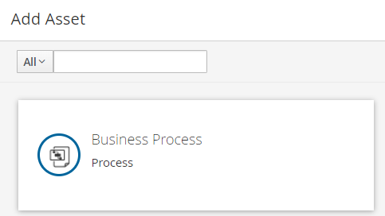
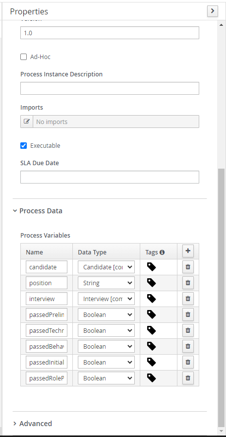

### Create Business Process Asset

1. Go to **Add Asset** and click on **Business Process**.

   

2. Name the business process as _hiring_ and set package to \*com.myspace.job_portal.

   

### Create Process Variables

1. Press the **Properties / pencil icon** on the top right corner.

   

2. Expand the **Process Data** and add the following variable in the **Process Variables**.

   | Name                       | Data Type |
   | -------------------------- | --------- |
   | candidate                  | Candidate |
   | position                   | String    |
   | interview                  | Interview |
   | passedPreliminaryFiltering | Boolean   |
   | passedBehavioralInterview  | Boolean   |
   | passedTechnicalInterview   | Boolean   |
   | passedInitialScreening     | Boolean   |
   | passedRolePlayInterview    | Boolean   |

3. It should look like this:

   

### BPMN Notations

[This](https://www.bpmnquickguide.com/view-bpmn-quick-guide/) is a useful guide for BPMN notation.

Quick guide:


### Start Event

1. Drag a start event node into the canvas.

2. Name it _Candidate Application_.

### Business Rule Task

1. Drag a **Business Rule** from the task toolbar and name it _Preliminary Filtering_.

2. Connect the start event to the business rule.

   

3. Click on the business rule and click on the **Properties** icon. Expand the **Implementation/Expression** tab.

4. Change the **Rule Language** to **DMN**.

5. Go to the _Preliminary Filtering_ DMN and go to the **Properties(pencil icon)** tab. Then copy its **Namespace**.

   

6. Paste it on the **Namespace** of the business rule.

7. Change the **Decision Name** to _Preliminary Filtering_ and the **DMN Model Name** to _prelim-filtering_.

   

8. Expand the **Data Assignments** tab and click on the pencil icon below **Assignments**.

   

9. Press **Add** of the **Data Inputs and Assignments** and key in the below informations.

   | Name      | Data Type | Source    |
   | --------- | --------- | --------- |
   | candidate | Candidate | candidate |
   | position  | String    | position  |

10. Press **Add** of the **Data Inputs and Assignments** and key in the below informations.

| Name                  | Data Type | Source                     |
| --------------------- | --------- | -------------------------- |
| Preliminary Filtering | Boolean   | passedPreliminaryFiltering |

11. It should look like below:

    

### Exclusive Gateway

1. Drag an **Exclusive** gateway from **Gateways**.

2. Connect the business rule to the gateway.

3. Drag an **Email** from **Workitem** and **User** from **Tasks**. Then connect the gateway to the email and task.

   

4. Change the name of the **Email workitem** ti _Rejection Email_ and the name of **User Task** to _Interview Arrangement_.

5. Since this is an **Exclusive** gateway, the process can only flow to either _Rejection Email_ or _Interview Arrangement_. Thus, we need to set the condition so that the program can decide which event to flow to.

   To do this,

   1. Click on the arrow directing from the _exclusive gateway_ to the _Interview Arrangement_.
   2. On its **Properties**, name it as _Passed minimum requirement_
   3. Expand the **Implementation/Execution** tab. Under the **Condition Expression**, check the **Condition** box.
   4. Change the **Process Variable** to _passedPreliminaryFiltering_ and **Condition** to _Is true_. (Note: You need to type in the process variable box to filter.)

   

   Remember that our business rule output is directed to _passedPreliminaryFiltering_ in the previous event. This ensures that only candidate that passed the _Preliminary Filtering_ will be getting _Interview Arrangement_.

6. Repeat similar step for the arrow directing from _exclusive gateway_ to the _Rejection Email_. But, in this case we name it to _Failed minimum requirement_ and set the **Condition** to _Is false_.

   

### Email Workitem

1. Click on the **Properties** of the _Rejection Email_ and expand the **Data Assignments** tab.

2. Click on the **pencil icon** under **Assignments**.

3. Click on the **Source** box beside **From** and choose _Expression ..._.

   

4. Then enter the email that you used for setting up the email custom task in the project. Our email will be automatically sent from this email.

   

5. Set the **Source** of the **To** to `#{candidate.email}`. This is because we do not want to sent to a fixed email, but we want to let the candidate to type in their own email when they initiate the process.

6. Set the **Source** of the **Subject** and **Body** to _Expression ..._ to write your email.

   As example:

   1. Set the **Subject** to
      ```
      Thank you for your job application!
      ```
   2. Set the **Body** to
      ```
      Dear #{candidate.name}, </br></br> We greatly appreciate your interest in our internship role. Unfortunately you did not meet the minimum requirement.
      ```

   In BPMN, we use `#{}` to insert a variable. In this case, the `#{candidate.name}` will be substituted to the candidate's name.
   We can also use html to format such as `</br>`.

7. It should look like this:

   

### User Task

1. Click on the _Interview Arrangement_ and open its **Properties**.

2. Expand the **Implementation/Execution** tab and change the **Task Name** to _InterviewArrangement_ and **Subject** to _Interview Arrangement for #{candidate.name}_.

   

3. Next, we need to decide who to assign the task to. In BPMN, we can choose to assign a task to specific person (Actors) or a group of people (Groups).

   For this task, we will assign to the HR group. Click on the **Add** under **Groups** and select _HR_.

   

   Note that the HR group is premade in the jBPM. We will look into how we can create our own group and user later.

4. Click on the **Pencil icon** under Assignments and key in the following informations.

   Data Inputs and Assignments:

   | Name      | Data Type | Source    |
   | --------- | --------- | --------- |
   | candidate | Candidate | candidate |

   Data Outpus and Assignments:

   | Name      | Data Type | Source    |
   | --------- | --------- | --------- |
   | interview | Interview | interview |

   

### Swimlane

Swimlane will not affect how the process is run. However, it is useful to illustrate the participants of a group of tasks.

1. Drag a swimlane and orientate it as below. (Tips: Drag the task to be on top of the swimlane.)

   

2. Name the swimlane to _HR_ as the participant for the interview arrangement is the HR.

   

### End Node

If the process reaches an end event, it will be considered complete.

1. Drag 2 end nodes and connect the _Rejection Email_ and _Interview Arrangement_ to each of them respectively.

   

2. Name the end node to _Candidate Rejected_ and _Interview Arranged_ respectively.

   

3. Press **Save** to save the changes.

Next, we will see how to create/modify users, roles and groups.
