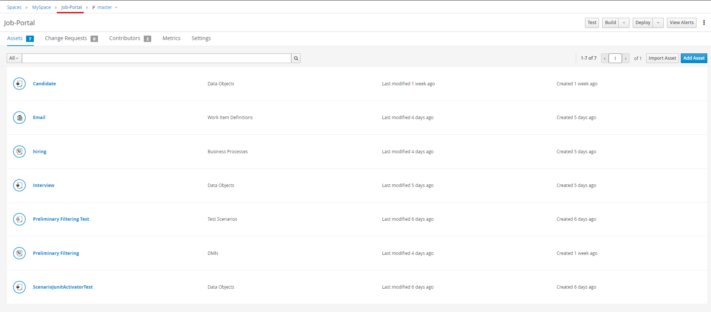
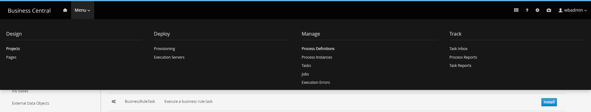
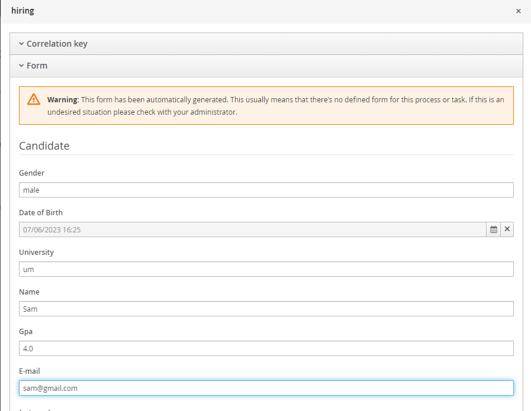
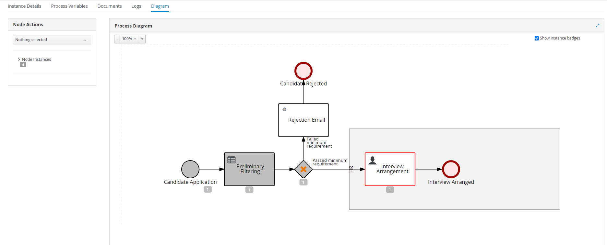

### Deploy Project

1. Navigate back to the _Job-Portal_ page.

   

2. Click on the **Deploy** on the top right corner.

   

### Process Definitions

1. Press the **Menu** on top and click on the **Process Definitions**.

   

2. In the Process Definitions page, we can see 1 process definition named hiring. Click on the vertical ellipsis and press **Start**.

   

3. You will now see an auto generated form which contains all the process variables. We will look at how to create our own form later.

### Starting process

#### Rejection Case

First we will test out if we can receive rejection email.

1. Key in the information of candidate such that the age of candidate is not greater than 21. Remember to key in your email as you will want to check if it is sent successfully.

   

2. You can leave the other fields empty and press **Submit**. You will be directed to the process-instance page.

   

3. Click on **Process Variables** to see the value of the process variables.

   

4. Clock on the **Diagram** to see an illustration of the workflow.

   

#### Passed case

Next, we will explore the passed case.

1. Go to **Process Definitions** and **Start** a new process.

2. Key in the information such that the candidate pass all the requirements (example: Gpa > 3.8 and Age > 21).

   

3. On the **Diagram** tab. We can see that the _Interview Arrangement_ is bordered in red. This means that the process is currently at the _Interview Arrangement_ event.

   

### Task Inbox

1. Press the **Menu** on top and click on the **task Inbox** under **Track**.

   

2.
