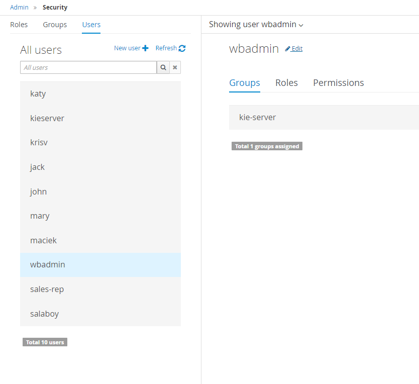
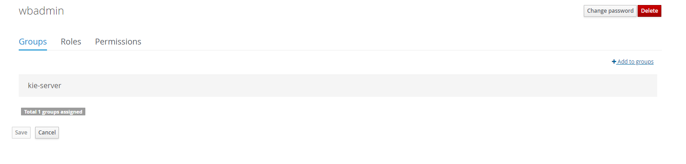
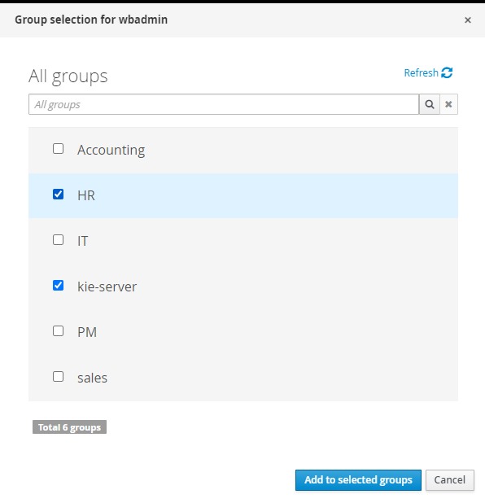
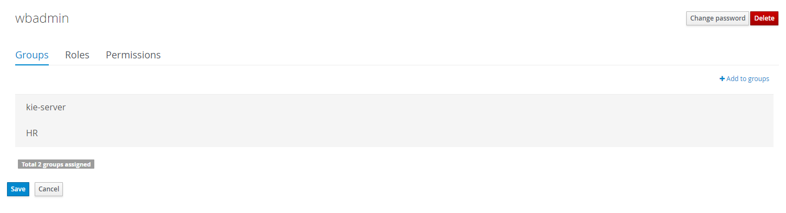
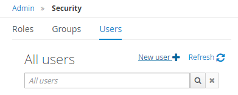
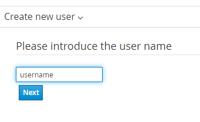
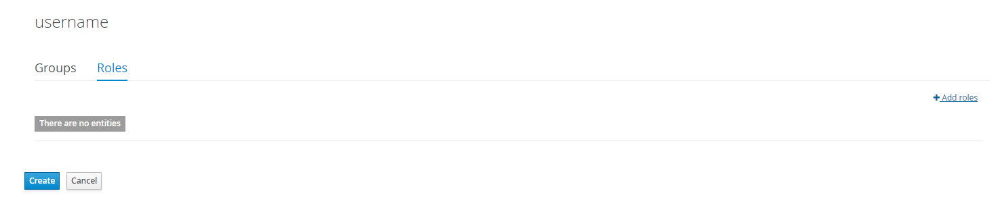
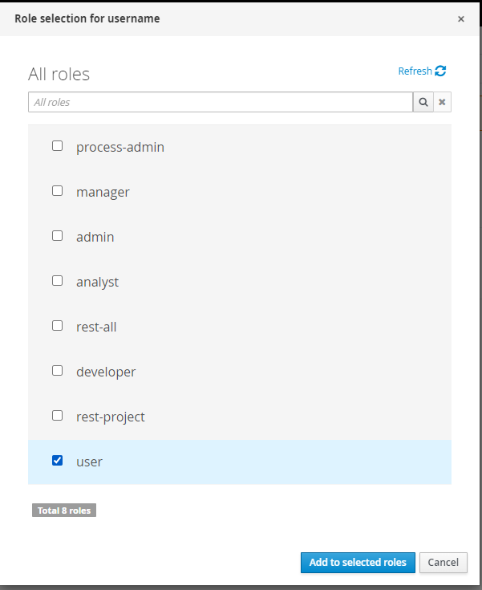
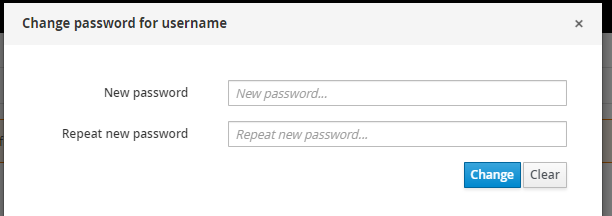

[This](https://access.redhat.com/documentation/en-us/red_hat_process_automation_manager/7.2/html/configuring_business_central_settings_and_properties/con-business-central-user-management_configuring-central#doc-wrapper) is the documentation of RHPAM on user and group management which can be used as a reference.

Note that different users has different privileges according to their roles. To modify users and groups, we will use the _wbadmin_ user.

### Editing Users

1. Press the **Setting** icon on the top right corner of Business Central.

   

2. Go to **Users**.

3. Here, we can modify existing users or add new users. Let's add the _wbadmin_ user to the _HR_ group.

4. Click on the _wbadmin_ user and click on the **Edit** button besides the user's name.

   

5. Clck on the **Add to groups** button.

   

6. Tick on the _HR_ group and click **Add to selected groups**.

   

7. Press **Save** to save the changes.

   

With this, the _wbadmin_ user is now in the _HR_ group.

### Creating User

1. To create a new user, press the **New user** button.

   

2. Key in the **username** of the new user and click **Next**.

   

3. You can add this new user to any groups or roles by clicking on the **Add to groups** or **Add roles**. We will add the role _user_ to this new user.

4. Click on the **Roles** then **Add roles**.

   

5. Tick the _user_ and press **Add to selected roles**.

   

6. Press **Create**. You will be prompted with a modal to set password. Click **Yes** and set a password.

   

### Others

Creating groups is similar to creating users. You can also change the permissions of different roles.

Next, we will deploy our process and see if everything is working.
