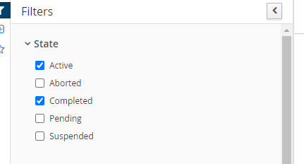

### Creating Forms

We will need to create individual form for start process and user task. Luckily, Business Central allow us to auto generate form based on our data assignments.

1. Go to _hiring.bpmn_.

   

2. Click on the **Form** icon on the toolbar above and select **Generate all forms**.

   

3. Navigate back to the _Job-Portal_ page.

   

4. Filter the file to **Form**.

   

5. Open the _Job-Portal.hiring-taskform_. This is the form for our start process.

6. Since we only want our process to start by keying in the candidate information and position, press the vertical elipsis on all other fields besides _Candidate_ and _Position_ then press remove.

   

7. The form should look as below:

   

8. Press **Save**.

### Deploy Project

1. Navigate back to the _Job-Portal_ page.

   

2. Click on the **Deploy** on the top right corner.

   

### Process Definitions

1. Press the **Menu** on top and click on the **Process Definitions**.

   

2. In the Process Definitions page, we can see 1 process definition named hiring. Click on the vertical ellipsis and press **Start**.

   

3. You will now see an auto generated form which contains all the process variables. We will look at how to create our own form later.

### Starting Process

#### Rejection Case

First we will test out if we can receive rejection email.

1. Key in the information of candidate such that the age of candidate is not greater than 21. Remember to key in your email as you will want to check if it is sent successfully.

   

2. You can leave the other fields empty and press **Submit**. You will be directed to the process-instance page.

   

3. Click on **Process Variables** to see the value of the process variables.

   

4. Clock on the **Diagram** to see an illustration of the workflow.

   

#### Accepted case

Next, we will explore the passed case.

1. Go to **Process Definitions** and **Start** a new process.

2. Key in the information such that the candidate pass all the requirements (example: Gpa > 3.8 and Age > 21).

   

3. Press **Submit**.

4. On the **Diagram** tab. We can see that the _Interview Arrangement_ is bordered in red. This means that the process is currently at the _Interview Arrangement_ event.

   

### Task Inbox

1. Press the **Menu** on top and click on the **Task Inbox** under **Track**.

   

2. Notice that we have a task named _Interview Arrangement_ in our Task Inbox. This is because the _Interview Arrangement_ task is assigned to the _HR_ group which the _wbadmin_ user is in from our previous exercise.

   

3. Click on the task to see the details of the task. Scroll to the bottom and click on **Claim** then **Start**.

   

4. Fill in the **Interviewer** and **Interview Date and Time** with some values and press **Complete**.

   

5. We have sucessfully completed our task.

### Process Instances

1. Press the **Menu** on top and click on the **Process Instances** under **Manage**.

   

2. Tick the **Complete** under **State**. This will allow us to see the completed process instance of both the rejection and accepted case.

   

3. Click on the accepted case process instance (which should be the latest one).

4. Go to **Diagram** and we can see that our process reaches the end node which indicates that it is completed.

   

5. Go to **Process Variables** and check that the **Value** is what we typed in. We can also see that the `passedPreliminaryFiltering` is set to `true` by the Business Rule.

   
