We will proceed with developing the workflow based on the diagram provided in our use case. However, please note that the diagram's complexity makes it difficult to provide a step-by-step instruction. It is assumed that you already have a basic understanding of how BPMN (Business Process Model and Notation) works from the previous exercise.

### Workflow to Sales or Technology

1.  We will create 2 swimlanes named _Sales_ and _Technology_.

2.  Connect _Interview Arrangement_ to an exclusive gateway and connect accordingly as below:

    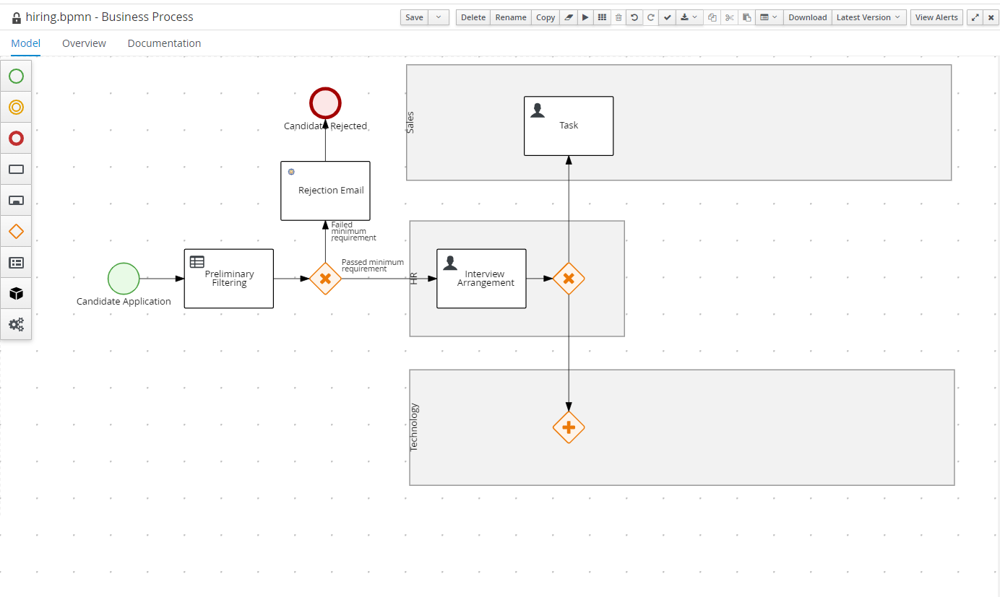

3.  Click on the arrow to _Sales_ and change its condition expression to

    ```
    position = "sales"
    ```

    Also, change the language to `FEEL`.

    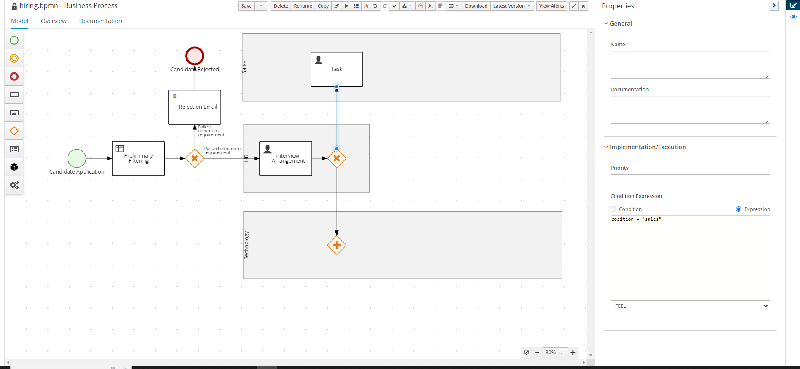

4.  Next, change the condition expression for the arrow connecting to _Technology_ to

    ```
    position = "technology"
    ```

### Sales Workflow

If a candidate is applying for a sales position, he will receive an _Initial Screening_. Should he pass, he will the receives a _Role-Play Interview_. If either fails, the candidate will receive a rejection email.

The _Initial Screening_ is conducted by the interviewer assigned by the _HR_ while the _Role-Play Interview_ can be conducted by anyone from the _sales_ team.

1. Construct the workflow as below:

   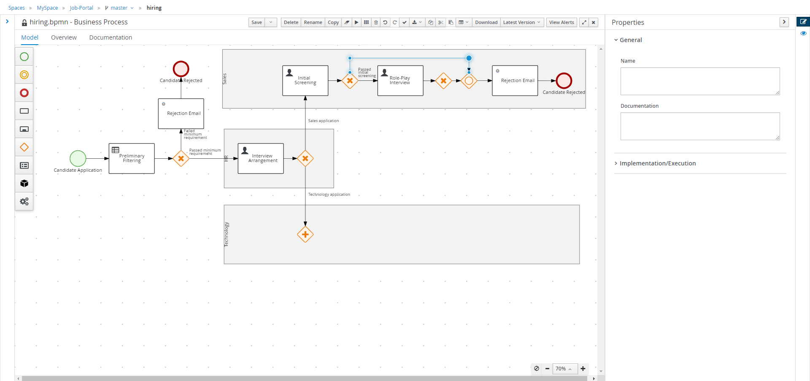

   (Tips: You can click on a segment of the sequence flow and drag up/down to form shapes)

2. Change the condition of the exclusive gateway accordingly based on the variables `passedInitialScreening` and `passedRolePlayInterview`.

   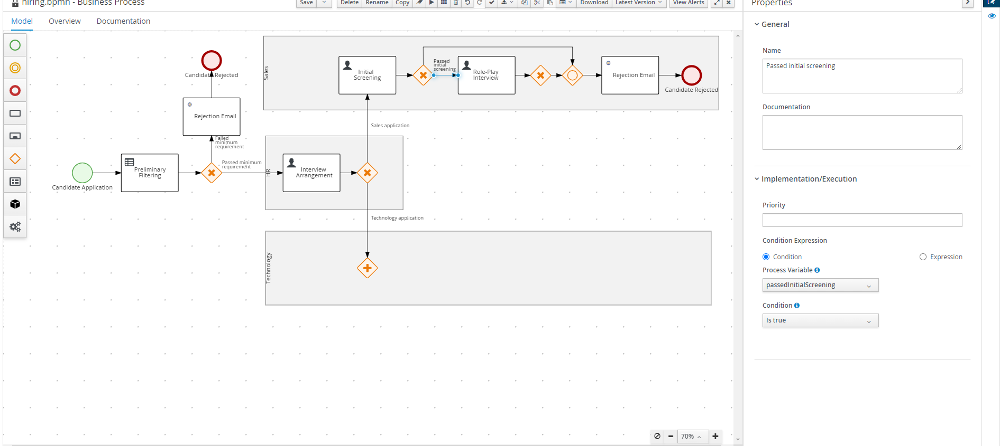

   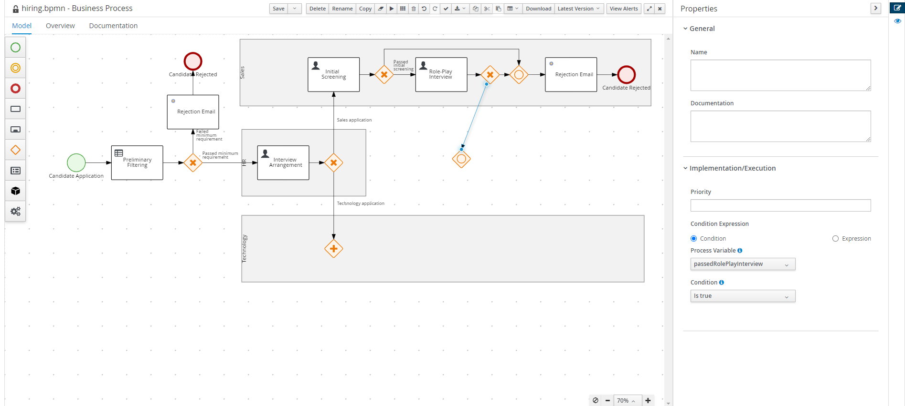

3. Change the data assignments of the _Rejection Email_ according to the previous email workitem. But, change the body to

   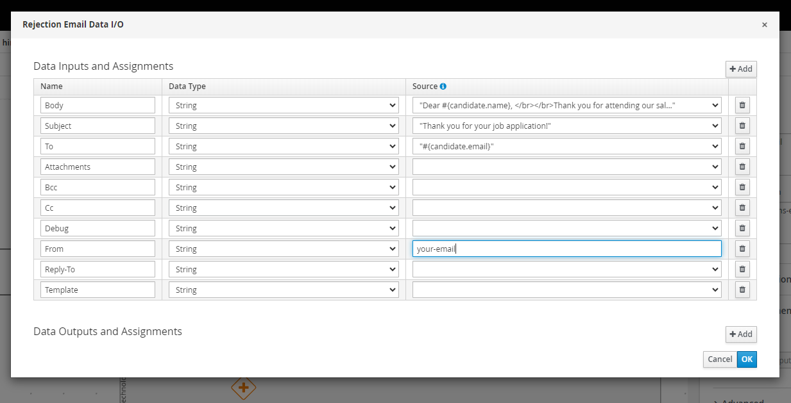

4. Change the Actors/Groups for 2 of the user tasks. _Initial Screening_'s actor should be set to `#{interview.interviewer}` while the group of _Role-Play Interview_ should be set to _sales_.

   (Note: You need to create a **New** actor. Meanwhile, _sales_ is a premade group in JBPM. Also do set the Task Name and Subject accordingly.)

   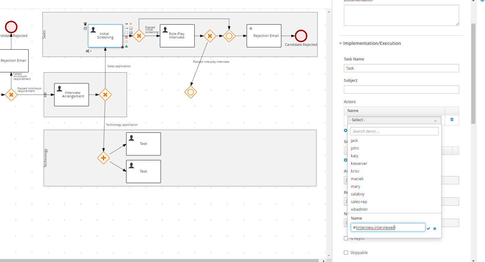

5. Set the data assignments of the 2 tasks.

   Initial Screening:

   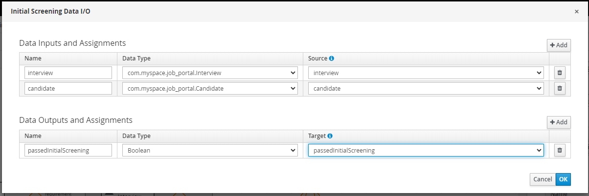

   Role-Play Interview:

   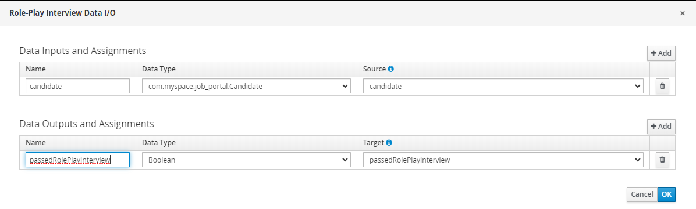

### Technology Workflow

If a candidate is applying for a technology position, he will receive both _Behavioral Interview_ and _Technical Interview_ concurrently. If either fails, the candidate will receive a rejection email.

The _Behavioral Interview_ is conducted by the interviewer assigned by the _HR_ while the _Technical Interview_ can be conducted by anyone from the _IT_ group.

1. Construct the workflow as below:

   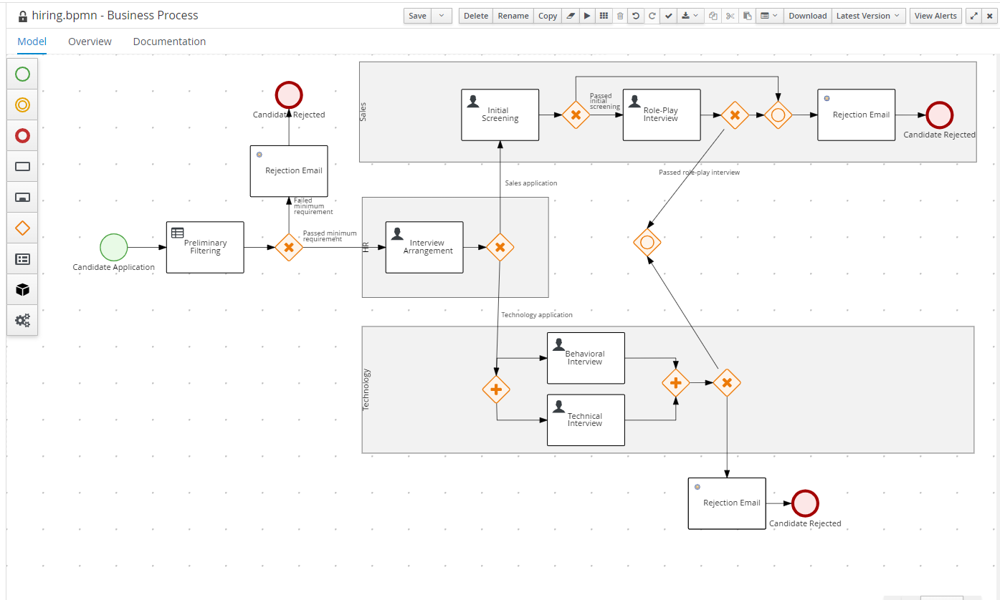

2. Change the condition expression of the exclusive gateway as below:

   The sequence flow connecting to _Rejection Email_:

   ```
   passedBehavioralInterview = false or passedTechnicalInterview = false
   ```

   and change the language to `FEEL`.

   The other sequence flow:

   ```
   passedBehavioralInterview = true and passedTechnicalInterview = true
   ```

   and change the language to `FEEL`.

   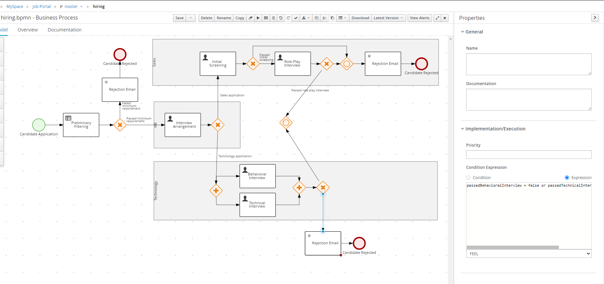

3. Change the actors/groups of the 2 tasks. Change the groups of _Technical Interview_ to _IT_, and the actors of _Behavioral Interview_ to `#{interview.interviewer}`.

   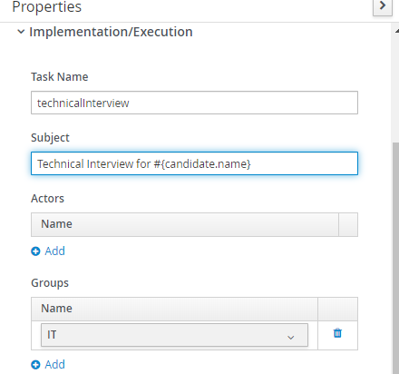

4. Change the data assignments of the 2 task as below:

   Behavioral Interview:

   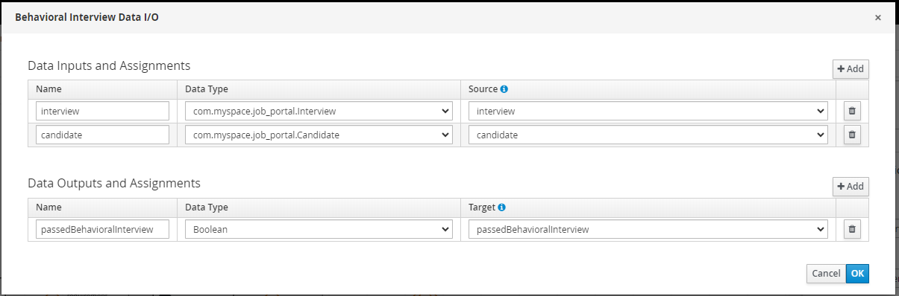

   Technical Interview:

   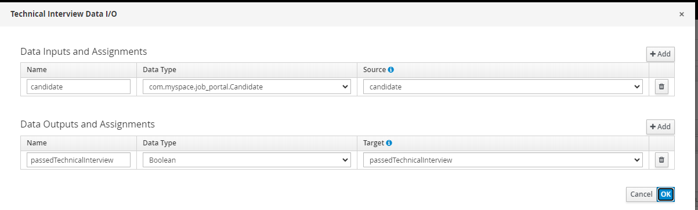

5. Change data assignments of email workitem according to the previous exercise. But, change the body to below

   > Dear #{candidate.name}, </br></br> Thank you for attending our technology interview. We regret to inform you that your application is unsuccessful.

### Candidate Workflow

If a candidate passes his interviews, he will get a _Job Offer_ task in which he can accept the offer or reject. Candidate will receive an onboarding email.

1. Create workflow as below:

   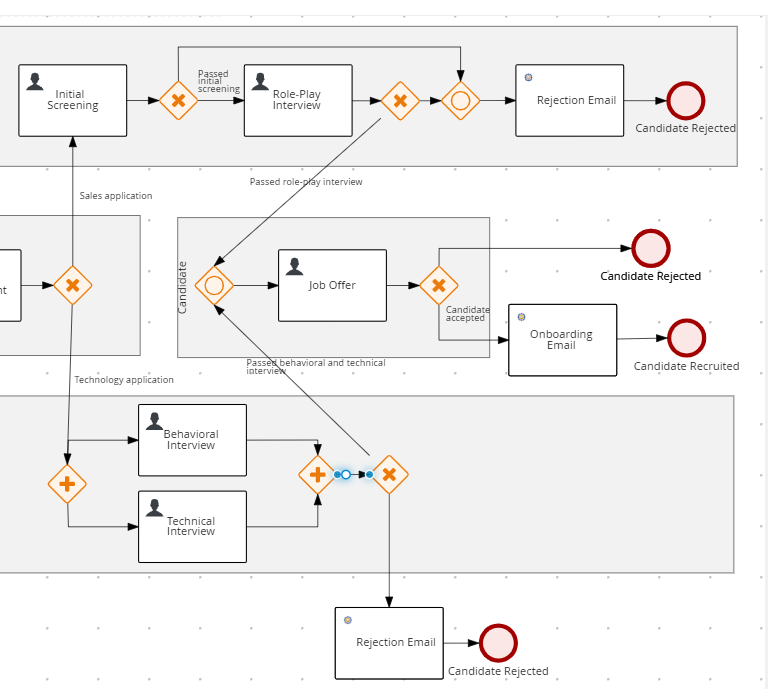

2. Change the actors of the _Job Offer_ task to `#{candidate.name}`.

   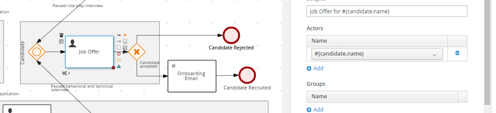

3. Add a process variable named _hasAcceptOffer_ and type to _Boolean_. Then set the data assignments of _Job Offer_ as below:

   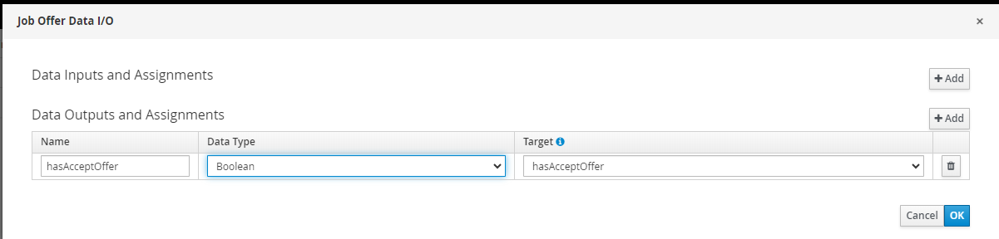

4. Change the data assignments of the _Onboarding Email_. Put _Welcome Onboard_ as subject and

   > Dear #{candidate.name}, </br></br> I want to extend a warm welcome to you! We are thrilled to have you join our company, and we are confident that you will make a valuable contribution to our team.

5. Change the condition of the exclusive gateway such that if `hasAcceptOffer` is `true`, the process goes to _Onboarding Email_, else _Candidate Rejected_.

   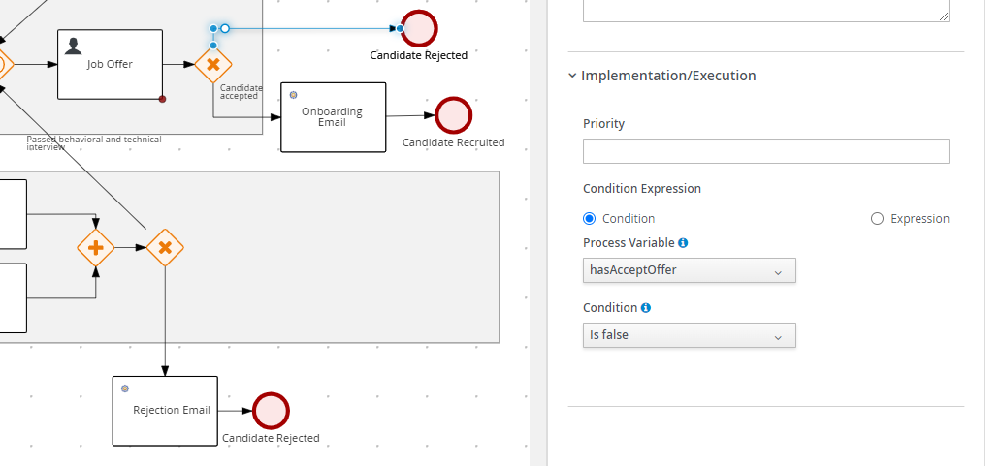

### Offer Timeout

We also want to set a timeout period for the job offer. To ease our testing, we will set the offer timeout to 1 minute after the offer is given.

1. Pull the **Immediate Timer** and put it on top of the _Job Offer_.

   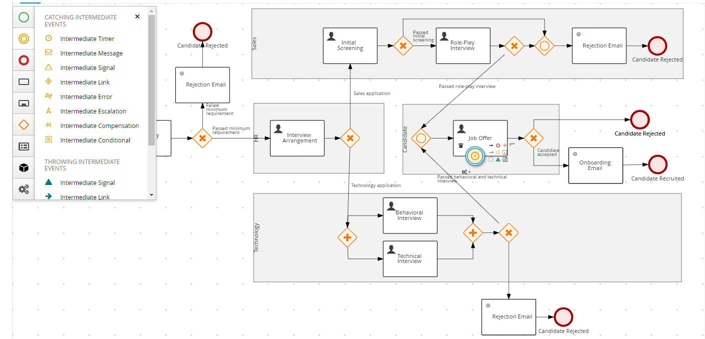

2. Construct workflow as below:

   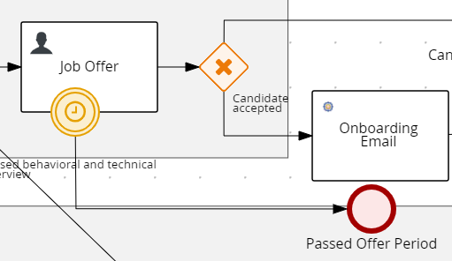

3. Go to **Properties** of the timer and write _PT1M_ on the **Fire once after duration**. (Note: The duration is in ISO-8601 format)

   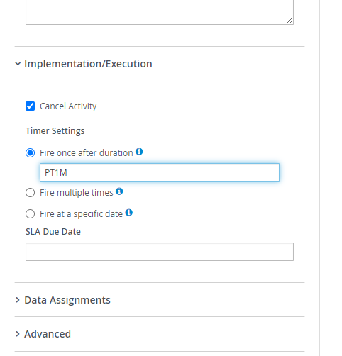

4. Press **Save**.

We have completed our workflow diagram!

[Here](https://github.com/zm-l/rhpam-demo/blob/main/MySpace_Job-Portal/project/src/main/resources/hiring.bpmn) is a sample of the bpmn diagram.

### Test Around

**Generate all forms** and redeploy the project. Play around and see if it works according to what we envision.

The complete project can be found [here](https://github.com/zm-l/rhpam-demo/tree/main/MySpace_Job-Portal/project).
