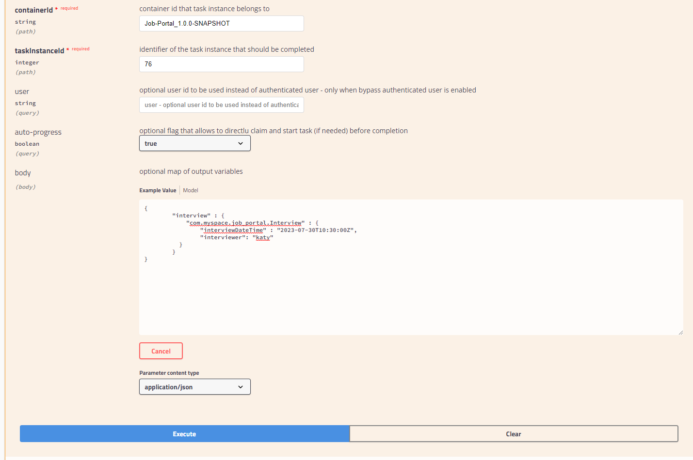

The Execution Server provides a rich RESTful API that allows user to interact with the process engine and deployed processes via a REST. This powerful feature allows users to create modern user interface and applications in their technology of choice (e.g. Entando DXP, ReactJS/Redux, AngularJS, etc.) and integrate these applications with the process engine to create modern, process driven, enterprise applications.<br/><br/>
The Swagger interface provides the description and documentation of the Execution Server’s RESTful API. At the same time, it allows the APIs to be called from the UI. This enables developers and users to quickly test, in this case, a deployed business process. (quoted from [here](https://timwuthenow.github.io/guided_exercises/04_order_management/lab-walkthrough/#execute-the-process-via-apis))
{:.info}

This exercise follows the Tim Wuthernow [guide](https://timwuthenow.github.io/guided_exercises/04_order_management/lab-walkthrough/#execute-the-process-via-apis) closely.

### Process Instance

1.  Navigate to the [KIE Server Swagger Page](http://localhost:8080/kie-server/docs/).

2.  Locate the Process instances section. The Process Instances API provides a vast array of operations to interact with the process engine.

3.  Locate the **POST** operation for the resource `/server/containers/{containerId}/processes/{processId}/instances`. This is the RESTful operation with which we can start a new process instance. Expand the operation:

    

4.  Click on the **Try it out** button.

    1. Set the **containerId** to `Job-Portal_1.0.0-SNAPSHOT`.

       The container id can be found in the **Execution Servers**.

       

    2. Set the processId to `Job-Portal.hiring`.

       

    3. Set Parameter content type to `application/json`.

5.  Set the body to:

    ```json
    {
        "candidate" : {
            "com.myspace.job_portal.Candidate" : {
                "dob" : "1999-12-30",
                "email" : "sam@gmail.com",
                "gender" : "male",
                "gpa": "3.9",
                "name": "Sam",
                "university": "um"
          }

        },
        "position": "sales"
    }

    ```

    

6.  Click on the Execute button.

7.  If requested, provide the username and password of your Business Central and KIE-Server user (in this example we have been using u: wbadmin, p:wbadmin).

8.  Inspect the response. Note that the operation returns the process instance id of the started process.

9.  Go back to the Business Central workbench. Go the process instances view and inspect the process instance we have just started.

### Process queries

The RESTful API provides many more operations. Let’s use the API to fetch our Task List and complete the _Interview Arrangement_ task.

1. In the Swagger API, navigate to the Process queries section.

2. Find the GET operation for the resource `/server/queries/tasks/instances/pot-owners`. Expand the operation and click on the Try it out button.

3. Make sure the **Response content type** is set to `application/json`. Leave all the other fields set to their default values.

4. Click on the **Execute** button. This will return all the tasks for our user (in the case of this example this is the _wbadmin_ user).

   

5. We can see the _Interview Arrangement_ task that is available in our inbox. Let’s complete this task.

### Task instances

1. Go to the Task Instances section in the Swagger interface and locate the PUT operation of the `/server/containers/{containerId}/tasks/{taskInstanceId}/states/completed resource`. This is the operation with which we can complete a task.

2. Set the **containerId** to `Job-Portal_1.0.0-SNAPSHOT`.

3. Set the **taskInstanceId** to the id of the task instance you want to complete. The task instance id an be found in the list of task instances we got back from our previous REST operation.

4. Set **auto-progress** to true. This controls the auto progression of the taks through the various states of the task lifecycle (i.e. claimed, started, etc.)

5. Set the **Parameter content** type to `application/json`.

6. Set the **Response content** type to `application/json`.

7. Set the **body** to:

   ```json
   {
       "interview" : {
           "com.myspace.job_portal.Interview" : {
               "interviewDateTime" : "2023-07-30T10:30:00Z",
               "interviewer": "katy"
         }
       }
   }
   ```

   In this example, the `interviewDateTime` field represents the date and time value. The format follows the ISO-8601 standard, which includes the year, month, day, hour, minute, second, and the "Z" at the end indicates that the time is in UTC (Coordinated Universal Time).

   Hence, "2023-07-13T10:30:00Z" represents July 13, 2023, at 10:30:00 in UTC.

   

8. Click on the **Execute** button. If you’ve entered everything correctly, the task will be completed and the process will move to the next wait state, the _Interview Arrangement_ task. Go back to the Business Central workbench. Go to the process instances view. Select the process instance of the task you’ve just completed. Observe that the _Interview Arrangement_ task has been completed and that the process is now waiting on the _Initial Screening_ User Task.

   

The rest of the tasks can be completed in the same way via the API.
