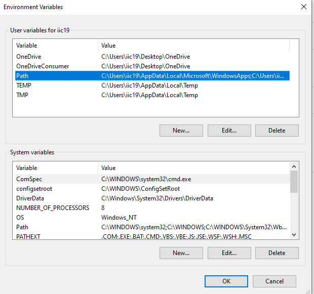
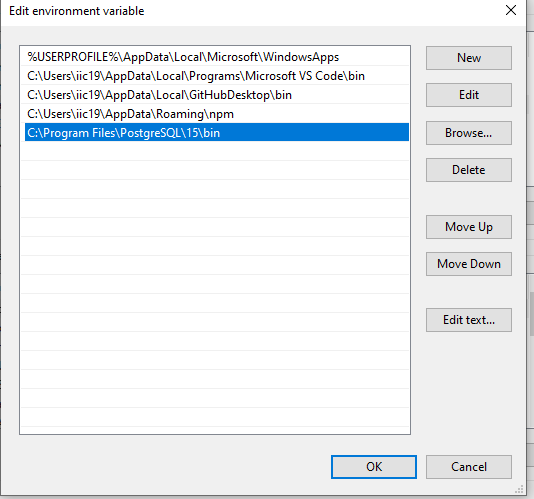

Please note that my approach to utilizing the JBPM server and a web app is purely experimental and may not adhere to established best practices or recommended guidelines. I cannot guarantee that the method I propose is correct or optimal. It is essential to consult official documentation and seek expert advice for proper implementation.
{:.warning}

To better explore the REST APIs provided by JBPM, I tried to experiment by making a job portal website frontend and backend while relying the JBPM server for the workflow logics.

However, I only made it with the intend to see how a website could utilize the REST APIs and not to make a fully usable website. Hence, the website is riddled with flaws such as security, loading pages, etc.

The website is shared on GitHub [here](https://github.com/zm-l/rhpam-demo/tree/main) in the `my-app` directory. You can clone and run it locally if you wish to.

### NPM

- NPM

  On Windows:

  1.  Go to the Node.js website: https://nodejs.org/
  2.  Download the "LTS" (Long-Term Support) version, which includes npm by default.
  3.  Run the installer and follow the installation instructions.

### Server

1. Go to `my-app/server`.

2. Run `npm i express nodemon` to install Express.js and Nodemon.

3. Run `npm install -g ts-node`.

ts-node is a popular utility for running TypeScript code directly without the need for compiling it to JavaScript first. It allows developers to execute TypeScript files (.ts) directly using Node.js, making it convenient for development and debugging purposes.

4. Then you can run `npm run dev` to run the server.

### Database

1. Download the PostgreSQL installer for Windows from the official website: https://www.postgresql.org/download/windows/.

   At the setup, keep the default port number (p: 5432). You can also tick to download the pgAdmin4 for a graphical interface of the PostgreSQL.

2. After installing, try running `psql` in terminal. If you encounter `psql not recognized as an internal or external command`, these steps might help:

   1. Go to enviroment variables.

   2. Edit the `PATH`.

      

   3. Check the directory of your PostgreSQL. If you downloaded version 15, it might be `C:\Program Files\PostgreSQL\15\bin`.

      

3. Run `psql -U postgres` and type in the password you set in the setup to connect to the PostgreSQL server.

4. Create a database named "job_portal". Run by running `CREATE DATABASE job_portal;`.

   1. Run `CREATE DATABASE job_portal;`.

5. Create a user named `wbadmin` and password is `wbadmin`.

   1. Run `CREATE USER wbadmin WITH PASSWORD 'wbadmin';`

   2. `GRANT ALL PRIVILEGES ON DATABASE job_portal TO wbadmin;`

6. Create tables named users and application in job_portal.

   1. Run `\c job_portal` to connect to the job_portal databse.

   2. Run

      ```sql
      CREATE TABLE users (
      id SERIAL PRIMARY KEY,
      username VARCHAR(50) NOT NULL,
      hashedpassword VARCHAR(255) NOT NULL,
      groups VARCHAR(50) NOT NULL
      );
      ```

      and

      ```sql
      CREATE TABLE application (
        id SERIAL PRIMARY KEY,
        username VARCHAR(100) NOT NULL,
        task_id INTEGER NOT NULL
      );
      ```
