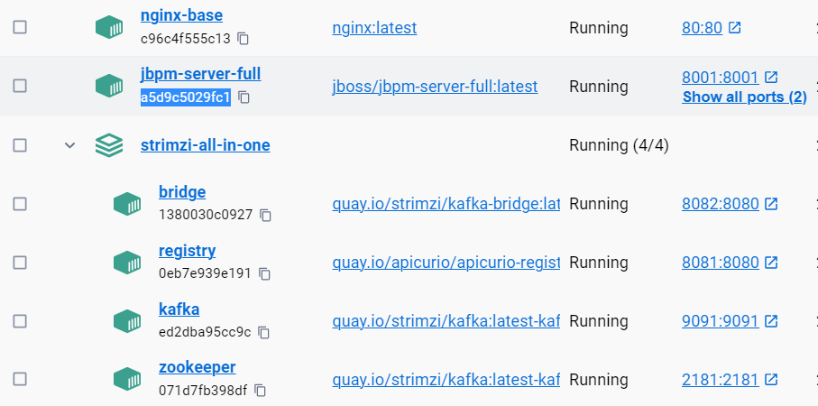
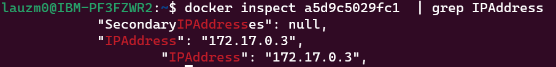

Since our Business Central is hosted on `localhost:8080`, calling the REST API of the Business Central will be blocked due to CORS policy. To bypass this, I set up a reverse proxy to allow requests from any origin for simplicity sake (there are security risks involed).

[This](https://www.youtube.com/watch?v=ZmH1L1QeNHk&ab_channel=CameronMcKenzie) is the guide I followed.

1.  On terminal, run `sudo docker run -d --name nginx-base -p 80:80 nginx:latest`.

    Note: This will serve the Nginx server on port 80. If you wish to host on another port (due to other process using port 80, etc), change `-p 80:80` to `-p {port_number:port_number}`. You will also need to change the server setting in `default.conf` file.
    {:.info}

2.  You will see a container named `nginx-base` is created in your Docker Desktop.

3.  To make it easy to modify the configurations, run `sudo docker cp nginx-base:/etc/nginx/conf.d/ {path to your Desktop}/default.conf` to copy to our Desktop. If you use WSL, it might be in `/mnt/c/Users/{your-username}/Desktop/default.conf`.

4.  Check your `jbpm-server-full` id in Docker Desktop and run `docker inspect {jbpm-server id}  | grep IPAddress`.

    

    You will see something as below:

    

    Note the IP down.

5.  Open the `default.conf` file. Add the following text inside the `server{}` component:

    ```
    location /business-central/rest {
        # Allow requests from any origin
        add_header 'Access-Control-Allow-Origin' '*';

        # Allow specified HTTP methods
        add_header 'Access-Control-Allow-Methods' 'POST, PUT, DELETE, OPTIONS, GET';

        # Allow specified headers in the request
        add_header 'Access-Control-Allow-Headers' 'Authorization, Content-Type';
        proxy_pass http://172.17.0.3:8080/business-central/rest;

        if ($request_method = 'OPTIONS') {
            # Om nom nom cookies
            add_header 'Access-Control-Allow-Credentials' 'true';
            add_header 'Access-Control-Allow-Methods' 'GET, POST, OPTIONS';
            # Custom headers and headers various browsers *should* be OK with but aren't
            add_header 'Access-Control-Allow-Headers' 'Authorization, DNT,X-CustomHeader,Keep-Alive,User-Agent,X-Requested-With,If-Modified-Since,Cache-Control,Content-Type';
            # Tell client that this pre-flight info is valid for 20 days
            add_header 'Access-Control-Max-Age' 1728000;
            add_header 'Content-Type' 'text/plain charset=UTF-8';
            add_header 'Content-Length' 0;
            return 204;
        }
    }

    location /kie-server/services/rest/server {
        # Allow requests from any origin
        add_header 'Access-Control-Allow-Origin' '*';

        # Allow specified HTTP methods
        add_header 'Access-Control-Allow-Methods' 'POST, PUT, DELETE, OPTIONS, GET';

        # Allow specified headers in the request
        add_header 'Access-Control-Allow-Headers' 'Authorization, Content-Type';
        proxy_pass http://172.17.0.3:8080/kie-server/services/rest/server;

        if ($request_method = 'OPTIONS') {
            # Om nom nom cookies
            add_header 'Access-Control-Allow-Credentials' 'true';
            add_header 'Access-Control-Allow-Methods' 'GET, POST, OPTIONS, PUT';
            # Custom headers and headers various browsers *should* be OK with but aren't
            add_header 'Access-Control-Allow-Headers' 'Authorization, DNT,X-CustomHeader,Keep-Alive,User-Agent,X-Requested-With,If-Modified-Since,Cache-Control,Content-Type';
            # Tell client that this pre-flight info is valid for 20 days
            add_header 'Access-Control-Max-Age' 1728000;
            add_header 'Content-Type' 'text/plain charset=UTF-8';
            add_header 'Content-Length' 0;
            return 204;
        }
    }

    ```

    Change both the `proxy_pass http://172.17.0.3:8080` to the IP address that you note down.

    Note: If you changed the port number in step 1, then in the `server{}` component, change as below:

    ```
    server {
        listen {port_number}
        listen [::]:{port_number}
        server_name localhost:{port_number}
    }
    ```

    A sample configuration can be found [here](https://github.com/zm-l/rhpam-demo/blob/main/nginx-config/default.conf).

6.  Run `sudo docker cp {path to desktop}/default.conf nginx-base:/etc/nginx/conf.d/` to copy the changed file to the docker.

7.  Run `sudo docker exec nginx-base nginx -t` to check the Nginx configuration files for syntax errors and report whether the configuration is valid or if there are any errors.

8.  Run `sudo docker exec nginx-base nginx -s reload` allows you to apply changes made to the configuration files.
