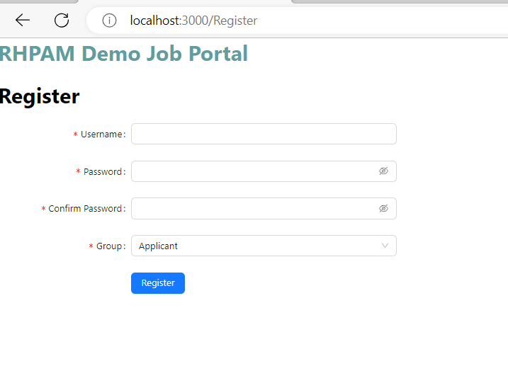
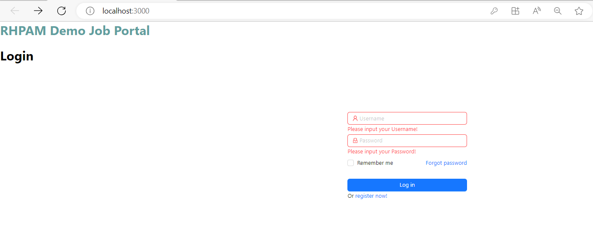

My registration page is to create a user in the Business Central via REST APIs while the log in page is to authenticate a given credential.

However, I could not find API to authenticate the user and his password. So, I decided to create my own backend server using Express and Postgresql to authenticate user when logging in.

## Backend Server

The [backend server](https://github.com/zm-l/rhpam-demo/tree/main/my-app/server) purpose is to authenticate users. The [JBPMSecurityManagementRestAPI](https://github.com/zm-l/rhpam-demo/blob/main/my-app/server/JBPMSecurityManagementRESTAPI.ts) mainly utilizes the [APIs](https://stackoverflow.com/questions/64914002/how-to-create-a-user-by-api-or-programmatically-in-jbpm-rhpam-bpmn-kie-server) that perform operation on users/groups. These APIs can also be found in the RHPAM documentations.

1. In the **Users, Roles and Groups** section, we have created a group called _applicant_ in Business Central. If you haven't done so, please refer back and create the group accordingly.

2. Refer to the [code](https://github.com/zm-l/rhpam-demo/blob/main/my-app/server/server.ts) commented with _Registration endpoint_ and _Login endpoint_ which are used for register and login respectively.

3. Since we have already put all the available JBPM security APIs into the class _JBPMSecurityManagementRestAPI_, hence we will use the class to interact with the JBPM APIs.

### Registration endpoint (Route: POST /register):

This endpoint is responsible for handling user registration. When a client sends a POST request to /register with the necessary information, the server will create a new user account in both the local database and the external JBPM (Business Central) system. Here's a step-by-step explanation of what the registration endpoint does:

- The client sends a JSON object containing the user's username, password, and group (which could be "applicant" or something else).
- The endpoint first checks if the username already exists in the local database by querying the users table. If the username exists, it returns a 409 Conflict status with an error message stating that the username already exists.
- If the username does not exist, the endpoint proceeds to hash and salt the provided password using bcrypt to securely store it in the database.
- It then inserts the username, hashedpassword, and group into the users table in the local database.
- Next, the endpoint makes a series of API requests to the external JBPM system. It uses the JBPMSecurityManagementRESTAPI class to interact with the JBPM API. The requests sent to the JBPM API involve creating the user, assigning user groups, assigning a role, and changing the user's password in the Business Central system.

Unfortunately the changing user's password API does not work. Hence, we will need to go to Business Central and manually changes the password for each user. Refer to the [Users, Roles and Groups](https://zm-l.github.io/rhpam/job-portal/users-roles-and-groups) section
{:.warning}

- If all the JBPM API requests are successful (i.e., return a status of 200), the server responds with a 200 OK status and a success message. If there is an error in the JBPM API requests, the server returns a 500 Internal Server Error status with an error message.

### Login Endpoint (Route: POST /login):

This endpoint handles user login and authentication. When a client sends a POST request to /login with the user's credentials, the server verifies the provided username and password against the stored data in the local database. Here's an explanation of what the login endpoint does:

- The client sends a JSON object containing the username and password.
- The endpoint checks if the provided username exists in the local database by querying the users table.
- If the username is not found in the database, it returns a 401 Unauthorized status with an error message indicating that the username or password is invalid.
- If the username exists in the database, the endpoint retrieves the hashed password associated with that username from the database.
- It then uses bcrypt to compare the provided password with the stored hashed password. If the passwords match, the user is considered authenticated, and the server responds with a 200 OK status and a success message.
- If the passwords do not match, the server returns a 401 Unauthorized status with an error message indicating that the username or password is invalid.

### Summary

In summary, the registration endpoint allows users to create new accounts by storing their credentials in the local database and creating corresponding user accounts in an external JBPM system. The login endpoint handles user authentication by verifying the provided credentials against the stored data in the local database.

## Frontend

### Register

The [register](https://github.com/zm-l/rhpam-demo/blob/main/my-app/client/src/pages/Register.tsx) component provides a user registration form which makes use of Ant Design component that allows users to provide their registration details (username, password, group) and submit the form to register as a new user. The registration data is then sent to the backend server for processing and database insertion, and the user's account is created in both the local database and an external JBPM (Business Central) system.

Below is a preview of the page:

### Login

The [login](https://github.com/zm-l/rhpam-demo/blob/main/my-app/client/src/pages/Login.tsx) component provides a login form that allows users to enter their username and password. When the form is submitted, it sends a login request to the backend server. Depending on the user's group, they are redirected to different pages after successful login.

Below is a preview of the page:

