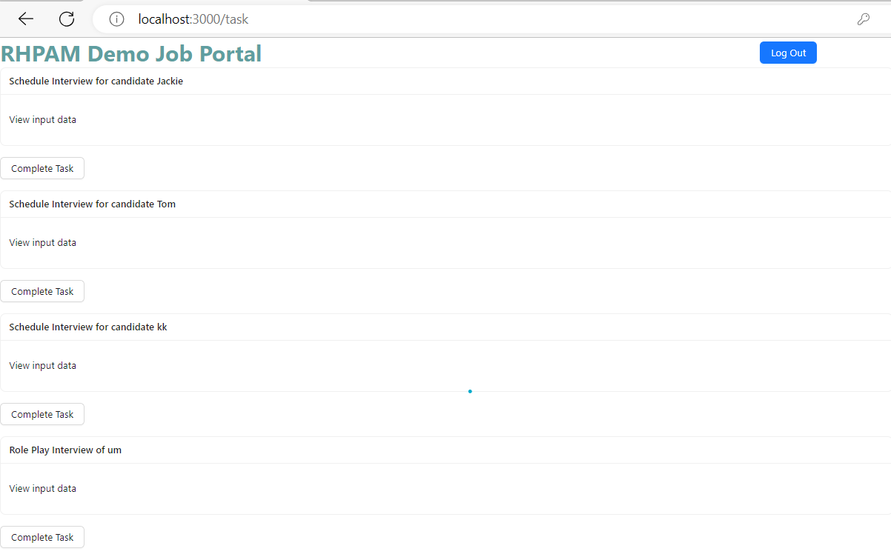
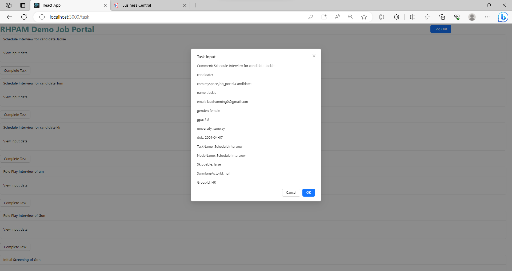
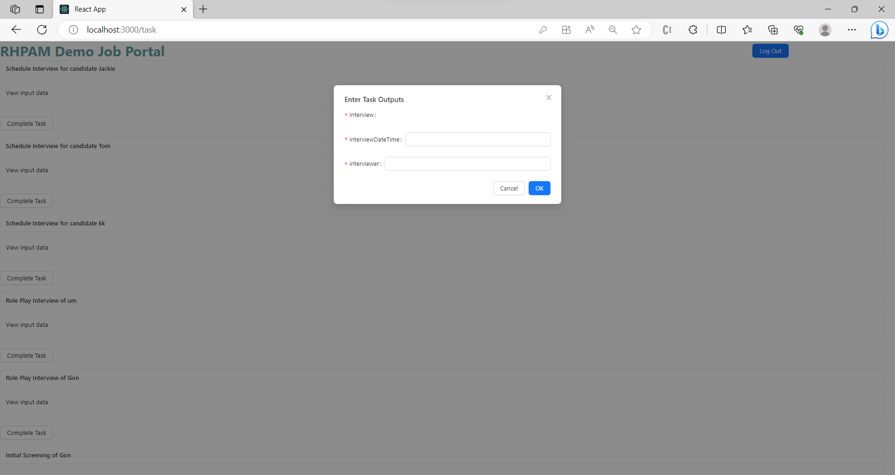

The tasks associated to a `staff` (non-applicant) is listed in the [Task](https://github.com/zm-l/rhpam-demo/blob/main/my-app/client/src/pages/Task.tsx) page. It allows `staff` to view the `input-data` of any tasks and complete them.

Below is a preview of the page:

1. The page will be autofilled with all the tasks that are assigned to the user via the `getTaskList` function in the `jBPMClient`.

2. Pressing the `View Input Data` will result in a modal popup that shows the input data of a particular task.

   

   This is done through the `getTaskInstanceDetails` function in the `jBPMClient`.

3. Pressing the `Complete Task` will show the data required to complete a task in a form.

   

   Calling the `getTaskOutput` function in the `jBPMClient` will return the required data of a particular task. Then, these datas are made into a form.

   Submitting the form will complete the task for the user via the `completeTaskInstance` function in the `jBPMClient`.
