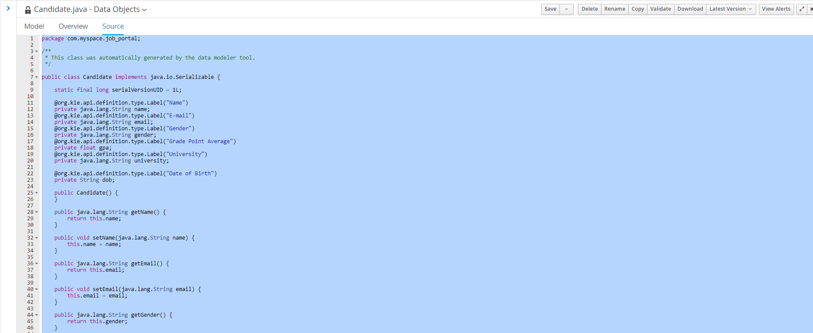
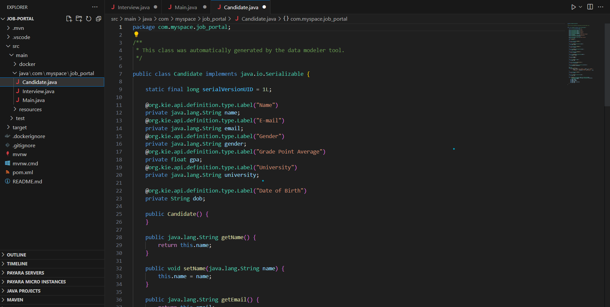

I referred to [this](https://timwuthenow.github.io/guided_exercises/01_getting_started/01_walk_through/)) to create the project.

### Install Maven

Follow [this](https://timwuthenow.github.io/guided_exercises/00_get_tools/env-setup/#maven) to install Maven.

### Create a Project

1. Run

   ```
   mvn io.quarkus:quarkus-maven-plugin:create \
       -DprojectGroupId=com.myspace -DprojectArtifactId=Job-Portal \
       -DprojectVersion=1.0.0-SNAPSHOT -Dextensions=kogito-quarkus,dmn,resteasy-reactive-jackson,quarkus-smallrye-openapi,quarkus-smallrye-health
   ```

   to create a project.

2. Add this block of code in the `<dependencies>` section of the `pom.xml`:

   > Note that it is not the `<dependencies>` inside the `<dependency management>`.

   ```yml
   <dependency>
       <groupId>jakarta.platform</groupId>
       <artifactId>jakarta.jakartaee-web-api</artifactId>
       <version>9.0.0</version>
       <scope>provided</scope>
   </dependency>
   <dependency>
      <groupId>org.kie.server</groupId>
      <artifactId>kie-server-client</artifactId>
      <version>7.30.0.Final</version>
      <scope>compile</scope>
    </dependency>
   ```

### Adding Custom Data Objects

1. Go to **Business Central**, Then go to **Projects** and **Job-Portal**.

2. Filter by _Data Objects_, then click into the **Candidate**.

3. Go to **Source** and copy the source code.

   

4. Create a file named **Candidate.java** in the `src\main\java\com\myspace\job_portal\Candidate.java` (Note: Create the `job_portal` folder.). Then paste source the code into the file.

   

5. Repeat with the **Interview** data object.
